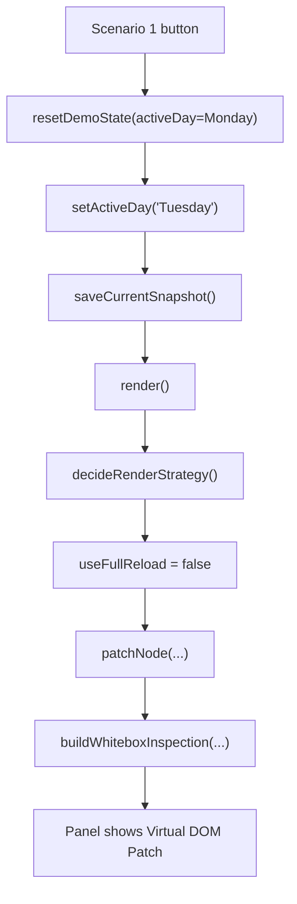
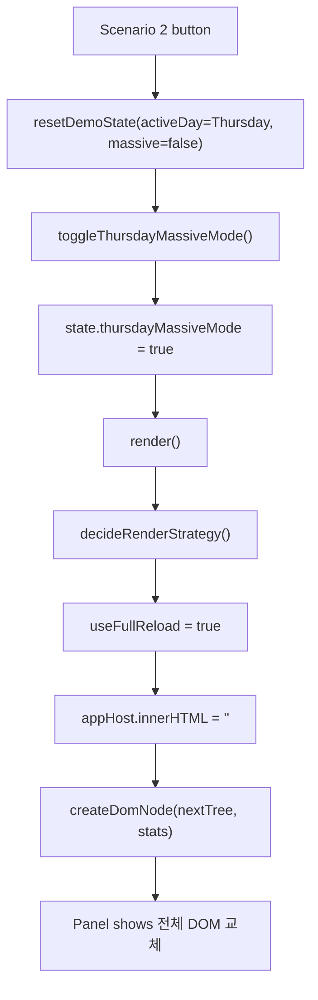
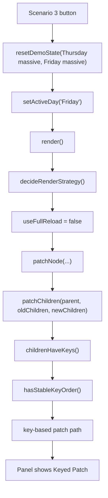

# 🌳 Virtual DOM & Diff Algorithm

> React의 핵심 개념인 **Virtual DOM**과 **Diff 알고리즘**을 Vanilla JS로 직접 구현하고,
> 그 동작 과정을 실시간으로 시각화하는 인터랙티브 웹 애플리케이션입니다.


---

## 📋 목차

- [프로젝트 소개](#-프로젝트-소개)
- [실행 방법](#-실행-방법)
- [아키텍처](#-아키텍처)
- [핵심 개념](#-핵심-개념)
  - [왜 Virtual DOM인가?](#왜-virtual-dom인가-reflow--repaint-문제)
  - [Virtual DOM 구조](#virtual-dom-구조-vnode)
  - [Diff 알고리즘 5가지 케이스](#diff-알고리즘--5가지-케이스)
  - [Patch 적용 과정](#patch-적용-과정)
  - [State History (Undo/Redo)](#state-history--undoredo)
- [구현 상세](#-구현-상세)
- [React와의 비교](#-react와의-비교)
- [엣지 케이스 처리](#-엣지-케이스-처리)
- [기술적 의사결정](#-기술적-의사결정)

---

## 🎯 프로젝트 소개

이 프로젝트는 React 내부의 핵심 메커니즘인 **Virtual DOM**과 **Reconciliation(조정)** 과정을
외부 라이브러리 없이 순수 Vanilla JS로 직접 구현합니다.

### 주요 기능

| 기능 | 설명 |
|------|------|
| **Virtual DOM 구현** | `createElement`, `domToVNode`, `vnodeToDOM` |
| **Diff 알고리즘** | 5가지 케이스 처리 (REPLACE / PROPS / TEXT / INSERT / REMOVE) |
| **Patch 적용** | 최소한의 네이티브 DOM API로 실제 DOM 업데이트 |
| **실시간 시각화** | Old VTree / New VTree 나란히 비교, 변경 노드 하이라이트 |
| **Diff 로그 패널** | 각 패치 타입별 색상 코딩 및 변경 내용 표시 |
| **State History** | Undo/Redo, 클릭 가능한 히스토리 타임라인 |

---

## 🚀 실행 방법

```bash
# 외부 의존성 없음 — 브라우저에서 바로 실행
open index.html

# 또는 로컬 서버로
python -m http.server 8080
# → http://localhost:8080
```

---

## 🏗 아키텍처

```
index.html (단일 파일)
├── <style>          CSS 커스텀 프로퍼티, 레이아웃, 애니메이션
└── <script>
    ├── Section 1    VNode 구조체 & createElement 헬퍼
    ├── Section 2    DOM ↔ VNode 변환 (domToVNode / vnodeToDOM / vnodeToHTML)
    ├── Section 3    Diff 알고리즘 (diff / diffProps / countNodes)
    ├── Section 4    Patch 적용 (patch / buildIndexMap / flashNode)
    ├── Section 5    HTML 파서 유틸 (parseHTML)
    ├── Section 6    State History Manager
    ├── Section 7    VTree 시각화 렌더러
    ├── Section 8    Diff 로그 렌더러
    ├── Section 9    히스토리 타임라인 렌더러
    ├── Section 10   에러 토스트
    ├── Section 11   상태 적용 헬퍼 (applyState)
    ├── Section 12   미리보기 업데이트
    └── Section 13   초기화 & 이벤트 리스너 (init)
```

### UI 레이아웃

```
┌─────────────────────────────────────────────────────────┐
│  🌳 Virtual DOM & Diff Algorithm          Vanilla JS   │
├──────────────────────────┬──────────────────────────────┤
│  Real DOM                │  HTML 편집기                  │
│  (Patch 결과 렌더링)       │  (textarea, monospace)       │
│                          │  ─────────────────────────── │
│                          │  Live Preview               │
├──────────────────────────┴──────────────────────────────┤
│  [◀ 뒤로]  [▶ Patch 적용]  [앞으로 ▶]   [초기][#1][#2]  │
├─────────────────────────────────────────────────────────┤
│  Diff 로그 패널                                          │
│  🟢 INSERT  🔴 REMOVE  🟡 REPLACE  🔵 PROPS  🟣 TEXT    │
├──────────────────────────┬──────────────────────────────┤
│  Old VTree               │  New VTree (변경 노드 강조)   │
└──────────────────────────┴──────────────────────────────┘
```

---

## 📚 핵심 개념

### 왜 Virtual DOM인가? (Reflow / Repaint 문제)

브라우저의 실제 DOM 조작은 다음 과정을 거칩니다:

```
DOM 변경
  ↓
Style 계산 (Recalculate Style)
  ↓
Layout (Reflow) ← 위치·크기 재계산, 매우 비싼 연산
  ↓
Paint (Repaint) ← 픽셀 채색
  ↓
Composite      ← 레이어 합성
```

**문제점:**
- 속성 하나를 변경해도 전체 레이아웃 재계산이 발생할 수 있음
- 100개의 리스트 아이템을 개별 업데이트하면 100번의 Reflow 발생
- `offsetHeight`, `scrollTop` 같은 속성 읽기도 강제 Reflow 유발

**Virtual DOM의 해결책:**
1. 변경사항을 메모리(JS 객체)에서 먼저 계산
2. Old VTree와 New VTree를 비교 (diff)
3. 실제로 변경된 부분만 최소한의 DOM 조작으로 일괄 적용 (patch)
4. → Reflow/Repaint 횟수를 대폭 줄임

---

### Virtual DOM 구조 (VNode)

```js
// 요소 노드
{
  type: 'element',
  tagName: 'div',       // 소문자 태그명
  props: {
    id: 'title',
    class: 'container',
    style: 'color: red;',
    'data-key': '1',
    // ...
  },
  children: [VNode, VNode, ...],
  key: '1',             // data-key에서 추출 (리스트 최적화용)
}

// 텍스트 노드
{
  type: 'text',
  text: 'Hello World',
  key: null,
}
```

---

### Diff 알고리즘 — 5가지 케이스

이 구현은 React와 동일하게 **O(n)** 알고리즘을 사용합니다.
트리 전체를 비교하는 일반 알고리즘(O(n³))과 달리,
**같은 레벨·같은 위치의 노드만 비교**하는 휴리스틱을 적용합니다.

#### Case 1: REPLACE — 노드 전체 교체

타입이 다르거나(`element` vs `text`) 태그명이 다를 때 노드를 통째로 교체합니다.

```
Old: <div class="card">     New: <section class="card">
     ↑ tagName 다름
→ REPLACE patch 생성 → parent.replaceChild(newEl, oldEl)
```

#### Case 2: TEXT — 텍스트 내용 변경

두 노드가 모두 텍스트 노드인데 내용이 다를 때, `textContent`만 업데이트합니다.

```
Old: "Item 1"   New: "Item One"
→ TEXT patch → target.textContent = "Item One"
```

#### Case 3: PROPS — 속성 변경

같은 태그인데 속성이 달라졌을 때, 변경된 속성만 업데이트합니다.

```
Old: <li class="item">          New: <li class="item active">
→ PROPS patch → { class: { old: "item", new: "item active" } }
→ el.setAttribute('class', 'item active')

Old: <h1 id="title" style="color:#333">   New: <h1 id="title">
→ PROPS patch → { style: { old: "color:#333", new: null } }
→ el.removeAttribute('style')
```

#### Case 4: INSERT — 자식 노드 추가

새 VTree에 자식이 더 많을 때, 추가된 위치에 새 노드를 삽입합니다.

```
Old children: [li1, li2, li3]
New children: [li1, li2, li3, li4]  ← li4 추가
→ INSERT patch → parent.appendChild(vnodeToDOM(li4))
```

#### Case 5: REMOVE — 자식 노드 삭제

Old VTree에 자식이 더 많을 때, 초과된 노드를 제거합니다.

```
Old children: [li1, li2, li3]
New children: [li1, li2]            ← li3 삭제
→ REMOVE patch → parent.removeChild(li3El)
```

---

### Patch 적용 과정

```
[diff 결과 patches 배열]
  ↓
buildIndexMap(domRoot)
  - DFS 순서로 실제 DOM 순회
  - Map<number, Node> 생성 (index → DOM Node)
  ↓
각 patch를 순서대로 적용
  - map.get(patch.index) 로 대상 노드 즉시 탐색 O(1)
  - 네이티브 API만 사용: replaceChild / setAttribute / removeAttribute
    / insertBefore / appendChild / removeChild
  - 변경된 노드에 CSS 애니메이션 (flashNode)
```

**핵심: DFS 인덱스 맵**

`diff()`와 `buildIndexMap()`은 동일한 DFS 순회 순서를 사용하므로,
`patches[i].index`가 가리키는 번호가 실제 DOM의 동일한 노드를 정확히 가리킵니다.

```
VNode 트리:            DFS 인덱스:
div (container)   →   0
  h1              →   1
    "Virtual..."  →   2
  p               →   3
    "This is..."  →   4
  ul              →   5
    li[0]         →   6
      "Item 1"    →   7
    ...
```

---

### State History — Undo/Redo

```js
const history = {
  states: [],   // VNode 스냅샷 배열 (깊은 복사)
  cursor: -1,   // 현재 위치

  push(vnode)  // Patch 후 호출 → cursor 이후 기록 삭제 후 새 상태 추가
  undo()       // cursor-- → 이전 VNode 반환
  redo()       // cursor++ → 다음 VNode 반환
  goTo(i)      // 특정 인덱스로 이동
}
```

Undo/Redo 시에는 히스토리의 VNode로부터 `vnodeToDOM()`을 사용해
실제 DOM을 완전히 재빌드합니다.

---

## 🔧 구현 상세

### `domToVNode(node)`

```
실제 DOM 노드 (Node)
  ↓ nodeType 확인
  ├── TEXT_NODE      → { type: 'text', text: textContent }
  ├── ELEMENT_NODE   → 속성 추출 + childNodes 재귀 변환
  └── 그 외           → null (주석 노드 등 무시)
```

공백 전용 텍스트 노드(`\n`, `  ` 등)는 무시합니다.
이는 `buildIndexMap()`의 동일한 로직과 동기화되어 있습니다.

### `diff(oldV, newV, patches, idx, path)`

- `idx`는 참조로 전달되는 DFS 인덱스 카운터 `{ v: number }`
- 자식 순회 시 각 자식의 서브트리 크기(`countNodes`)만큼 인덱스를 진행
- `path` 문자열로 `root > ul > li[2]` 형태의 경로 추적

### `patch(domRoot, patches)`

- `patches`는 diff의 결과물을 순서대로 적용
- **주의**: INSERT/REMOVE 패치는 이후 노드들의 DOM 위치를 바꿀 수 있습니다.
  이 구현에서는 단순화를 위해 사전 빌드한 인덱스 맵을 사용하며,
  복잡한 다중 삽입/삭제 케이스에서는 재빌드가 필요할 수 있습니다.

---

## ⚛️ React와의 비교

| 항목 | 이 구현 | React (Fiber) |
|------|---------|---------------|
| 알고리즘 복잡도 | O(n) | O(n) |
| 비교 단위 | DOM 레벨 | 컴포넌트/Fiber 노드 |
| 스케줄링 | 동기 (즉시 적용) | 비동기 (Concurrent Mode, 시간 분할) |
| Key 최적화 | data-key 속성 읽기 | key prop |
| Batching | 없음 | setState 자동 배치 |
| 이벤트 위임 | 없음 | SyntheticEvent 풀링 |
| 트리 비교 | 같은 레벨·위치만 | 같은 레벨·위치 + key 매칭 |

### React Fiber 아키텍처와의 관계

React 16부터 도입된 **Fiber** 아키텍처는 다음을 가능하게 합니다:
- **작업 분할**: 렌더링을 작은 단위(Fiber 노드)로 쪼개어 우선순위에 따라 중단/재개
- **Concurrent Mode**: 사용자 입력 등 고우선순위 작업을 낮은 우선순위 렌더링보다 먼저 처리
- **Reconciliation**: Fiber 트리를 두 개(current, work-in-progress) 유지하며 비교

이 프로젝트는 **동기 방식**의 단순화된 버전으로, React의 핵심 개념(VNode, diff, patch)을
명확하게 이해하는 데 초점을 맞춥니다.

---

## 🛡 엣지 케이스 처리

| 케이스 | 처리 방식 |
|--------|-----------|
| 빈 태그 `<div></div>` | children 배열이 비어 있는 VNode로 정상 처리 |
| 자기 닫힘 태그 `<br>`, `` | `VOID_TAGS` Set으로 자식 생성 차단 |
| 텍스트만 있는 노드 | type: 'text' VNode로 처리, TEXT patch 적용 |
| 깊게 중첩된 구조 | DFS 재귀로 처리, 인덱스 카운터 참조 전달 |
| 속성만 변경 | PROPS patch만 생성, 자식은 재귀 비교 |
| 노드 타입 변경 | REPLACE patch, 서브트리 전체 교체 |
| 공백 텍스트 노드 | `domToVNode`와 `buildIndexMap` 모두 무시 |
| 잘못된 HTML 입력 | `parseHTML`에서 null 반환 → 에러 토스트 표시 |
| 변경 없는 Patch | 빈 patches 배열 → "변경 없음" 로그 표시 |
| History 경계 | `canUndo()`/`canRedo()`로 버튼 비활성화 |
| 빈 실제 DOM | `vnodeToDOM`으로 완전 재빌드 |

---

## 💡 기술적 의사결정

### innerHTML 사용 금지
`patch()` 함수 내에서 `innerHTML`을 사용하면 전체 서브트리가 재생성됩니다.
네이티브 DOM API(`replaceChild`, `setAttribute`, `insertBefore` 등)를 사용해
**최소한의 DOM 조작**만 수행합니다.

### DFS 인덱스 방식
각 노드에 고유한 ID를 부여하는 대신, DFS 순회 순서(정수 인덱스)를 사용합니다.
`diff()`와 `buildIndexMap()`이 **동일한 순회 순서**를 보장하면
`patches[i].index`가 항상 정확한 DOM 노드를 가리킵니다.

### VNode 깊은 복사 (State History)
히스토리에 저장할 때 `JSON.parse(JSON.stringify(vnode))`로 깊은 복사를 수행합니다.
이는 함수나 특수 객체를 포함하지 않는 순수 데이터 구조이기 때문에 안전합니다.

### DocumentFragment 미사용
이 구현에서는 개별 패치를 즉시 적용합니다.
React는 배치 업데이트를 통해 모든 변경을 모은 뒤 한 번에 DOM에 반영하지만,
시각화 목적의 이 프로젝트에서는 패치별 애니메이션 효과를 위해 즉시 적용 방식을 선택했습니다.

---

## 📁 파일 구조

```
virtual-dom-diff/
├── index.html    메인 애플리케이션 (HTML + CSS + JS, 단일 파일)
├── README.md     이 문서
└── plan.md       구현 계획서
```

---

<p align="center">
  Made with Vanilla JS — no frameworks, no dependencies.
</p>

---

## White-box Scenario Diagrams

The `Weekly Travel Journal.html` demo uses four presentation scenarios.
Each scenario is documented with:

- input
- internal branch
- render result
- code point to inspect

### Scenario 1: Monday -> Tuesday uses patch



```js
function setActiveDay(day) {
  if (state.activeDay === day) return;
  saveCurrentSnapshot();
  state.activeDay = day;
  render();
}
```

Check values:

- `state.activeDay === "Tuesday"`
- `decision.useFullReload === false`
- `renderMode === "Virtual DOM Patch"`

### Scenario 2: Entering Thursday 10,000 mode uses full reload



```js
if (!isCurrentMassive && isNextMassive) {
  return {
    useFullReload: true,
    reason: "목요일 10,000개 데이터가 포함된 이동이라 전체 DOM 교체를 선택했습니다.",
    nextProfile
  };
}
```

Check values:

- `state.thursdayMassiveMode === true`
- `decision.nextProfile === "thursday-massive"`
- `decision.useFullReload === true`

### Scenario 3: Thursday massive -> Friday massive uses keyed patch



```js
function patchChildren(parent, oldChildren, newChildren, stats) {
  const useKeyedDiff = childrenHaveKeys(oldChildren) || childrenHaveKeys(newChildren);

  if (hasStableKeyOrder(oldChildren, newChildren)) {
    for (let index = 0; index < newChildren.length; index += 1) {
      patchNode(parent, oldDomChildren[index], oldChildren[index], newChildren[index], stats);
    }
    return;
  }
}
```

Check values:

- `state.activeDay === "Friday"`
- `decision.nextProfile === "friday-massive"`
- `decision.useFullReload === false`
- keyed diff path is used
