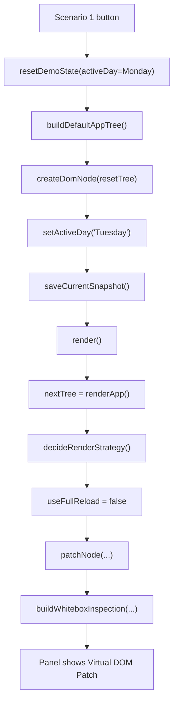
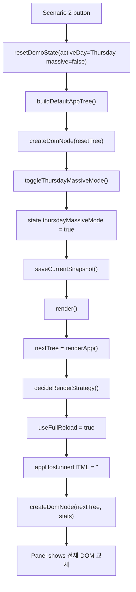
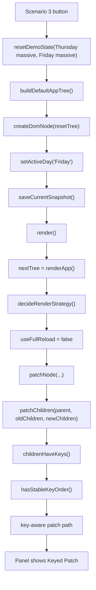

# Virtual DOM & Diff Algorithm

> Vanilla JS로 Virtual DOM, Diff, Patch 과정을 직접 구현하고
> 변경 흐름을 시각적으로 확인할 수 있는 학습형 데모 프로젝트입니다.

---

## 목차

- [프로젝트 소개](#프로젝트-소개)
- [실행 방법](#실행-방법)
- [주요 기능](#주요-기능)
- [레이아웃](#레이아웃)
- [핵심 구현 포인트](#핵심-구현-포인트)
- [파일 구성](#파일-구성)
- [White-box Scenario Diagrams](#white-box-scenario-diagrams)

---

## 프로젝트 소개

이 프로젝트는 React의 핵심 아이디어인 Virtual DOM과 Diff/Patch 흐름을
라이브러리 없이 Vanilla JS로 직접 구현한 시각화 데모입니다.

메인 화면인 [`index.html`](/c:/Users/mnshell/Jungle/[WEEK4]/index.html)은
HTML 편집기, 실시간 미리보기, Diff 로그, VTree 시각화, Tree DOM Explorer를 한 화면에 배치해
"변경 전 트리"와 "변경 후 트리"가 어떻게 비교되고 실제 DOM에 반영되는지 확인할 수 있게 구성되어 있습니다.

함께 포함된 [`Weekly Travel Journal.html`](/c:/Users/mnshell/Jungle/[WEEK4]/Weekly%20Travel%20Journal.html)은
일반 Patch, 전체 DOM 교체, Key 기반 Patch를 비교하는 시나리오형 데모입니다.
특히 10,000개 데이터 진입/전환 상황과 White-box 패널을 통해
렌더 전략이 어떤 조건에서 달라지는지 내부 값까지 확인할 수 있습니다.

---

## 실행 방법

```bash
# 브라우저에서 바로 열기
open index.html

# 또는 로컬 서버 실행
python -m http.server 8080
```

브라우저에서 `index.html`을 열면 기본 Virtual DOM 데모를 사용할 수 있고,
파일 선택기에서 `Weekly Travel Journal.html`을 불러와 다른 렌더링 시나리오도 비교할 수 있습니다.

---

## 주요 기능

| 기능 | 설명 |
|---|---|
| Virtual DOM 생성 | `createElement`, `domToVNode`, `vnodeToDOM` 기반으로 VNode 트리 생성 |
| Diff 알고리즘 | `REPLACE`, `PROPS`, `TEXT`, `INSERT`, `REMOVE` 중심의 변경 탐지 |
| Patch 적용 | 변경된 부분만 실제 DOM에 반영해 최소 DOM 조작 수행 |
| 실시간 HTML 편집 | 우측 에디터에서 HTML을 수정하고 즉시 미리보기 반영 |
| Live Preview | iframe 기반 실행 영역에서 결과 DOM 상태 확인 |
| Diff 로그 패널 | 어떤 노드가 어떻게 바뀌었는지 타입별 로그로 표시 |
| Old/New VTree 시각화 | 이전 트리와 다음 트리를 나란히 비교하며 변경 노드 하이라이트 |
| History 탐색 | Undo / Redo / 시점 이동으로 상태 변화 추적 |
| 파일 전환 지원 | 기본 데모와 외부 HTML 파일을 선택해 같은 엔진으로 비교 가능 |
| Tree DOM Explorer | 트리 구조를 탐색하며 DOM/VTree 변화를 계층적으로 확인 |
| Massive 데이터 시나리오 | `Weekly Travel Journal.html`에서 10,000개 항목 렌더링 전략 비교 |
| White-box 시나리오 패널 | Patch / Full Reload / Keyed Patch 결정 과정을 내부 상태와 함께 확인 |

---

## 레이아웃

### 1. `index.html` 메인 데모 레이아웃

`index.html`은 학습과 비교에 맞춘 콘솔형 레이아웃으로 구성되어 있습니다.

| 영역 | 설명 |
|---|---|
| Header | 프로젝트 제목, 배지, 파일 선택기, 폴더에서 HTML 불러오기 |
| Live Preview | 실제 반영된 DOM을 iframe에서 확인 |
| HTML Editor | 수정할 HTML을 직접 입력하고 Patch 적용 |
| Controls Bar | Undo, Patch 적용, Redo, 새 탭 열기, 히스토리 이동 |
| Diff Log | 변경 연산을 로그 형태로 출력 |
| Old VTree / New VTree | 이전/이후 Virtual DOM 트리 비교 |
| Tree DOM Explorer | 트리 계층을 따라 노드 구조와 변경 포인트를 탐색 |
| External Tab Log | 외부 탭 반영 로그와 트리 비교 정보 확인 |

---

## 핵심 구현 포인트

- Virtual DOM 트리를 기준으로 이전 상태와 다음 상태를 비교합니다.
- Diff 결과를 패치 배열 또는 연산 로그 형태로 수집합니다.
- 실제 DOM에는 변경된 부분만 반영해 전체 재생성을 줄입니다.
- Key가 있는 자식 노드는 순서 안정성 여부에 따라 일반 비교 또는 key-aware 비교를 수행합니다.
- 대규모 리스트 진입 시점에는 Patch보다 전체 교체가 유리한 경우를 별도 전략으로 분기합니다.
- Tree DOM Explorer와 White-box 패널을 통해 결과뿐 아니라 내부 판단 근거도 확인할 수 있습니다.

---

## 파일 구성

```text
[WEEK4]/
├─ index.html
├─ Weekly Travel Journal.html
├─ README.md
├─ trees.module.js
├─ sidebar.module.js
├─ style.css
└─ 기타 보조 데모 파일
```

---

## White-box Scenario Diagrams

The `Weekly Travel Journal.html` demo uses four presentation scenarios.
Each scenario is documented with:

- input
- internal branch
- render result
- code point to inspect

### Scenario 1: Monday -> Tuesday uses patch



```js
function setActiveDay(day) {
  if (state.activeDay === day) return;
  saveCurrentSnapshot();
  state.activeDay = day;
  render();
}
```

Check values:

- `state.activeDay === "Tuesday"`
- `decision.useFullReload === false`
- `renderMode === "Virtual DOM Patch"`

### Scenario 2: Entering Thursday 10,000 mode uses full reload



```js
if (!isCurrentMassive && isNextMassive) {
  return {
    useFullReload: true,
    reason: "목요일 10,000개 데이터가 포함된 이동이라 전체 DOM 교체를 선택했습니다.",
    nextProfile
  };
}
```

Check values:

- `state.thursdayMassiveMode === true`
- `decision.nextProfile === "thursday-massive"`
- `decision.useFullReload === true`

### Scenario 3: Thursday massive -> Friday massive uses keyed patch



```js
function patchChildren(parent, oldChildren, newChildren, stats) {
  const useKeyedDiff = childrenHaveKeys(oldChildren) || childrenHaveKeys(newChildren);

  if (!useKeyedDiff) {
    const maxLength = Math.max(oldChildren.length, newChildren.length);
    for (let index = 0; index < maxLength; index += 1) {
      patchNode(parent, oldDomChildren[index], oldChildren[index], newChildren[index], stats);
    }
    return;
  }

  if (hasStableKeyOrder(oldChildren, newChildren)) {
    for (let index = 0; index < newChildren.length; index += 1) {
      patchNode(parent, oldDomChildren[index], oldChildren[index], newChildren[index], stats);
    }
    return;
  }

  const oldMap = new Map();
  const usedKeys = new Set();
  const desiredDomOrder = [];

  oldChildren.forEach((child, index) => {
    const key = getNodeKey(child, index);
    oldMap.set(key, { node: child, domNode: oldDomChildren[index] });
  });

  newChildren.forEach((newChild, index) => {
    const key = getNodeKey(newChild, index);
    if (oldMap.has(key)) {
      const matched = oldMap.get(key);
      const patchedDom = patchNode(parent, matched.domNode, matched.node, newChild, stats);
      desiredDomOrder.push(patchedDom);
      usedKeys.add(key);
      return;
    }

    desiredDomOrder.push(createDomNode(newChild, stats));
  });

  desiredDomOrder.forEach((domNode, index) => {
    const currentNode = currentComparableChildren[index];
    if (currentNode !== domNode) {
      parent.insertBefore(domNode, currentNode || null);
    }
  });
}
```

Check values:

- `state.activeDay === "Friday"`
- `decision.nextProfile === "friday-massive"`
- `decision.useFullReload === false`
- keyed diff path is used
- if key order changes, matching nodes are found again with `oldMap`
- DOM order is corrected with `insertBefore(...)`
